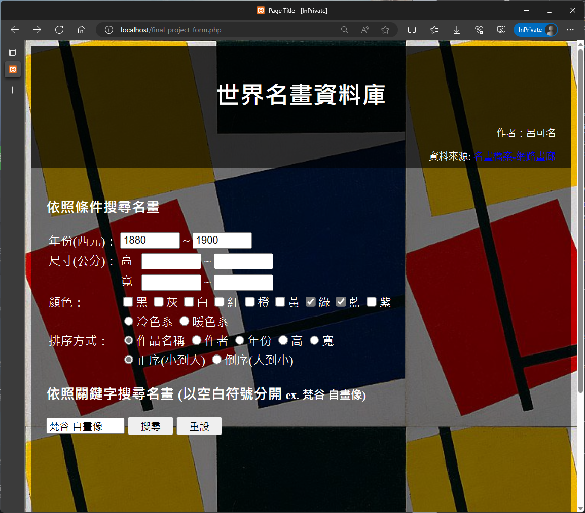
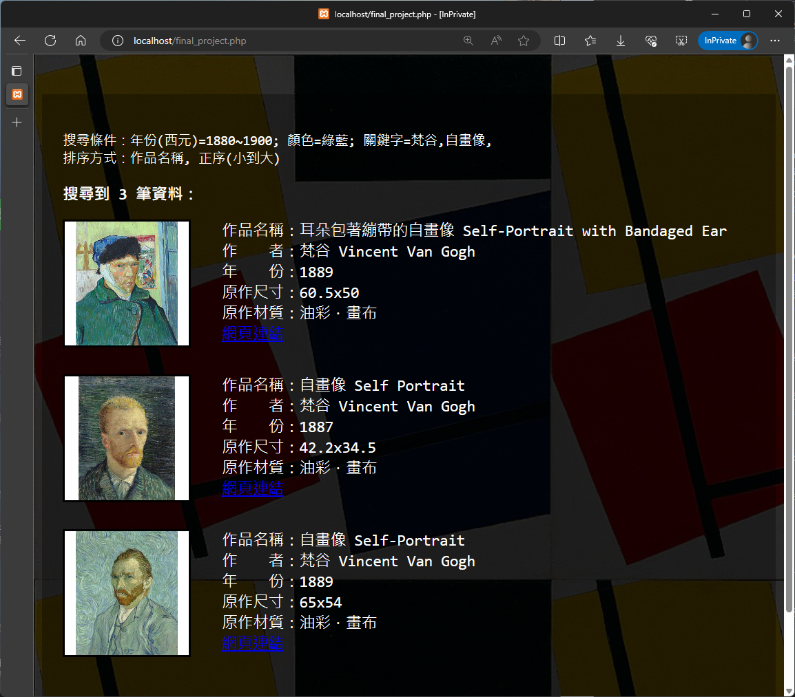

# world-famous-paintings-search-system
蒐集 名畫檔案-網路畫廊 (https://www.ss.net.tw/) 網頁中的名畫資訊，建立資料庫，並設計一個搜尋系統。

 

## Python 網路爬蟲

- 網址：https://www.ss.net.tw/
- 爬取資料：圖片、圖片編號、作者、年分、原作尺寸、原作材質、瀏覽人次

## OpenCV 顏色分析

- 建立顏色範圍表
- 計算每種顏色的遮罩比例
- 按照遮罩比例給予圖片標籤

## PHP 資料庫搜尋
